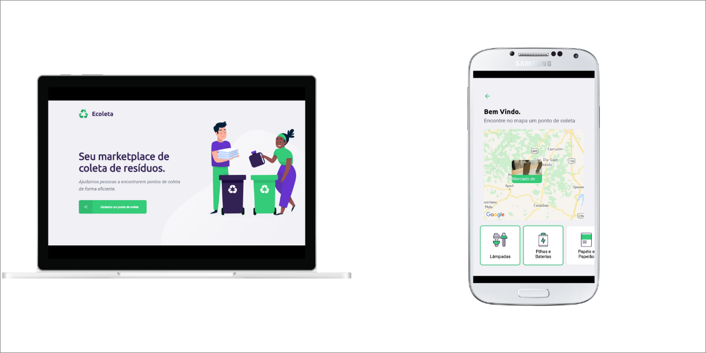

# :recycle: Ecoleta
Projeto desenvolvido durante o evento "Next Level Week" organizado pela [Rocketseat](https://rocketseat.com.br/). Consiste em um sistema completo, no qual pontos de coleta de resíduos podem ser registrados e encontrados por meio de um *app mobile*.

:star: **Recursos**:

- API com validações e conexão com banco de dados SQL.
- Plataforma web SPA com integração com a API do IBGE e com sistema de localização.
- Aplicativo mobile integrado com o Whatsapp e com o Google Maps.

**:rocket: Tecnologias:**

- [Node JS](https://nodejs.org/en/)
- [Typescript](https://www.typescriptlang.org/)
- [React JS](https://pt-br.reactjs.org/)
- [React Native](https://facebook.github.io/react-native/)
- [Expo](https://expo.io/)
- [SQLite](https://www.sqlite.org/index.html)

**:package: Bibliotecas:**
- [Express](https://expressjs.com/pt-br/)
- [React Navigation](https://reactnavigation.org/)
- [React Router](https://reacttraining.com/react-router/web/)
- [KNEX.js](http://knexjs.org/)
- [Axios](https://github.com/axios/axios)
- [React Native Maps](https://www.npmjs.com/package/react-native-maps)
- [Leaflet](https://leafletjs.com/)
- [Celebrate](https://www.npmjs.com/package/celebrate)

---

:coffee: Desenvolvido por Daniel Santos && <a href="https://github.com/Rocketseat">Rocketseat</a>

